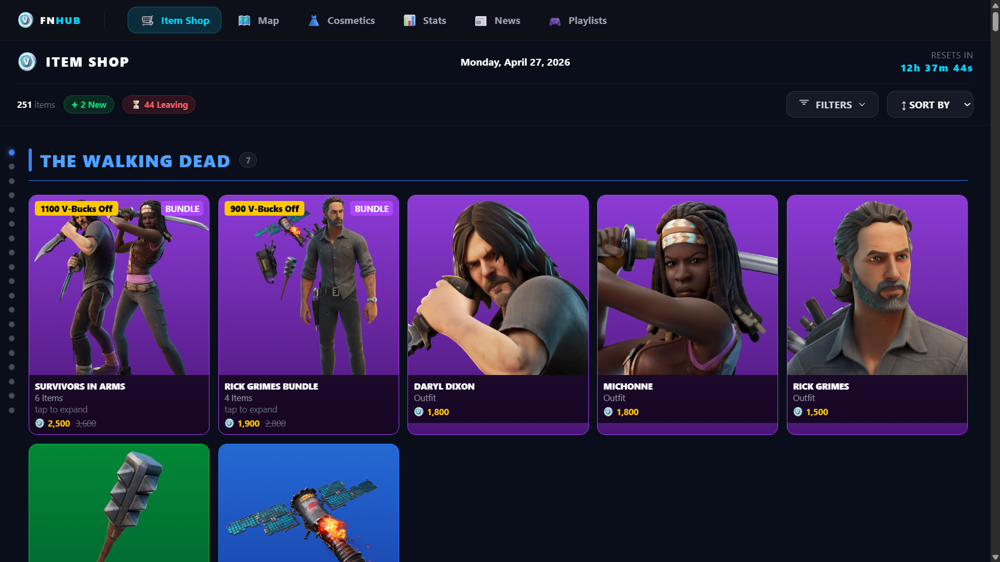
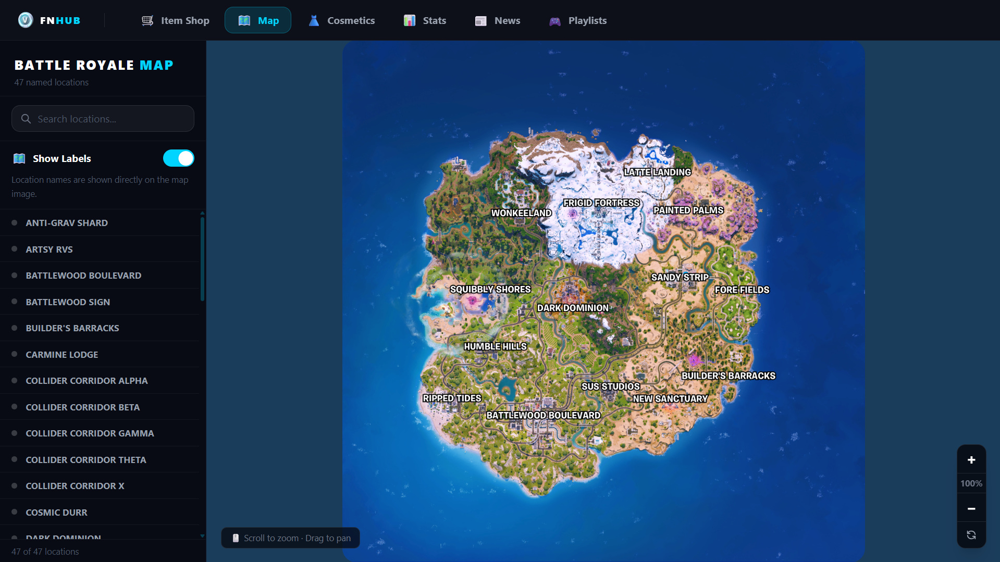
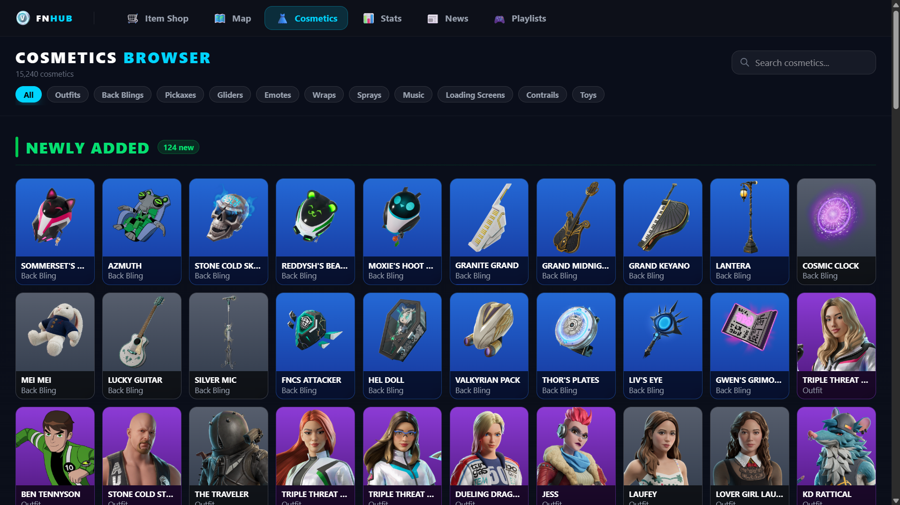
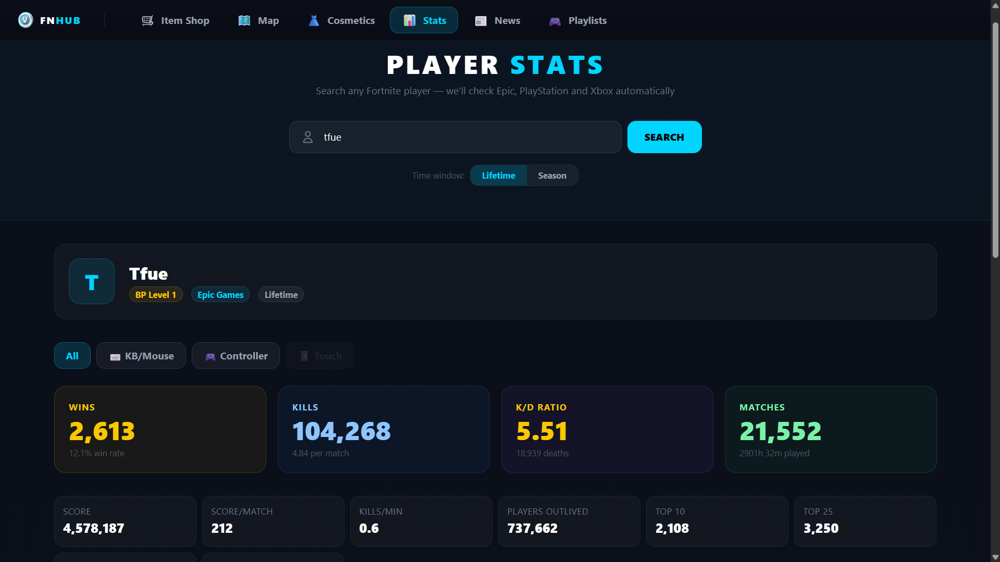
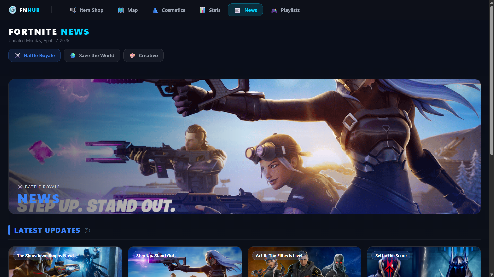
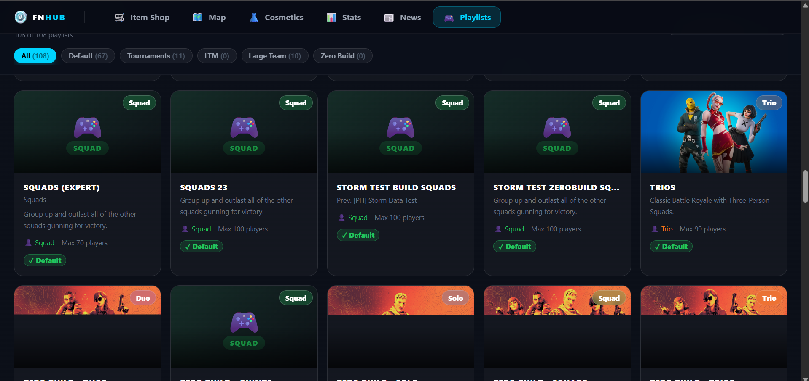

# 🎮 FNHub — Fortnite Companion App

> A full-featured Fortnite companion web application built with **React**, **TypeScript**, and **Tailwind CSS**. Browse the live Item Shop, explore the Battle Royale map, search cosmetics, look up player stats, read the latest news, and discover all game modes — all in one place.

🌐 **Live Site:** [fortnitehub.vercel.app](https://fortnitehub.vercel.app)



---

## 🚀 Features

### 🛒 Item Shop
- Live daily item shop updated automatically at midnight UTC
- **Live countdown timer** showing when the shop resets
- Items grouped by **layout sections** (collabs, featured, daily, etc.) matching the in-game order
- **Filter dropdown** grouped by category — Battle Royale, Rocket Racing, Festival, LEGO
- Quick filter buttons for **New Today** and **Leaving Soon**
- Sort by Default, Price ↑, Price ↓, or A–Z
- **Expandable dot sidebar** on desktop — hover to see section names and click to jump
- Click any item to open a **detail modal** with description, rarity, set info, introduction chapter, LEGO & Fall Guys alternate versions
- Click any bundle to see all items inside with individual item inspection
- Supports all item types: Outfits, Pickaxes, Back Blings, Gliders, Emotes, Wraps, Jam Tracks, Instruments, Cars, LEGO Kits



---

### 🗺️ Battle Royale Map
- Full interactive map powered by the Fortnite API
- **Scroll to zoom** (very smooth, slow zoom) and **drag to pan**
- Zoom controls built into the map corner (like Google Maps)
- Toggle between **Named** (with location labels) and **Blank** map versions
- Searchable **location list sidebar** with 47 named POIs
- Hover any location in the list to highlight it
- Ocean-colored background matching the map image



---

### 👗 Cosmetics Browser
- Browse **15,000+ Battle Royale cosmetics**
- **Newly Added** section at the top highlighting the latest cosmetics
- Filter by type: Outfits, Back Blings, Pickaxes, Gliders, Emotes, Wraps, Sprays, Music, Loading Screens, Contrails, Toys
- **Infinite scroll** — loads 60 items at a time automatically
- Search by name or description
- Click any cosmetic to view a **detail modal** with full info: rarity, set, introduction season/chapter, shop history count, and alternate LEGO/Fall Guys versions



---

### 📊 Player Stats
- Search any Fortnite player by username
- **Automatically searches Epic Games, PlayStation and Xbox** simultaneously — no need to select platform
- Shows which platform the player was found on
- Toggle between **Lifetime** and **Season** stats
- Switch between input types: All, Keyboard/Mouse, Controller, Touch
- **Hero stat cards** for Wins, Kills, K/D Ratio, and Matches with color-coded performance indicators
- Full **per-mode breakdown**: Solo, Duo, Squad, LTM
- All stats displayed: Score, Score/Match, Kills/Min, Players Outlived, Top placements, Time Played



---

### 📰 Fortnite News
- Latest news across all three Fortnite game modes
- **3 tabs**: Battle Royale, Save the World, Creative — each with its own accent color
- Full-width **section banner image** per tab
- News cards with hover zoom, video badge indicators, and tab title labels
- Click any card to open a **detail modal** with full body text, embedded YouTube video (if available), and a link to the official website
- Announcements section for in-game messages



---

### 🎮 Game Modes (Playlists)
- Browse all available Fortnite game modes/playlists
- **Deduplicated** — shows one card per unique mode name
- Filter by: Default, Tournaments, LTM, Large Team, Zero Build
- Search by name, description, or game type
- Color-coded by team size: Solo (blue), Duo (purple), Trio (orange), Squad (green)
- Each card shows team label, max players, and mode badges
- Click any mode to view a **full detail modal**: player/team limits, mode flags, gameplay tags, and added date
- Live filter counts shown on each filter pill

---

## 🛠️ Tech Stack

| Technology | Purpose |
|---|---|
| **React 19** | UI framework |
| **TypeScript** | Type safety |
| **Vite** | Build tool & dev server |
| **Tailwind CSS v4** | Styling |
| **React Router v6** | Client-side routing |
| **fortnite-api.com** | Data source |

---

## 📦 Getting Started

### Prerequisites
- Node.js 18+
- A free API key from [dash.fortnite-api.com](https://dash.fortnite-api.com)

### Installation

```bash
# Clone the repository
git clone https://github.com/YOUR_USERNAME/fortnitehub.git
cd fortnitehub

# Install dependencies
npm install

# Create environment file
cp .env.example .env
# Add your API key to .env:
# VITE_FORTNITE_API_KEY=your_api_key_here

# Start the development server
npm run dev
```

### Environment Variables

Create a `.env` file in the root directory:

```env
VITE_FORTNITE_API_KEY=your_api_key_here
```

Get your free API key at [dash.fortnite-api.com](https://dash.fortnite-api.com) by logging in with Discord.

### Build for Production

```bash
npm run build
```

---

## 📁 Project Structure

```
src/
├── api/
│   └── fortniteApi.ts          # All API functions & TypeScript interfaces
├── components/
│   ├── layout/
│   │   └── Navbar.tsx          # Navigation bar
│   └── shop/
│       ├── ShopItem.tsx        # Item shop card component
│       ├── BundleModal.tsx     # Bundle expansion modal
│       └── ItemDetailModal.tsx # Item detail modal
├── hooks/
│   └── useItemShop.ts          # Custom hook for item shop data
├── pages/
│   ├── Shop.tsx                # Item Shop page
│   ├── Map.tsx                 # Battle Royale Map page
│   ├── Cosmetics.tsx           # Cosmetics Browser page
│   ├── Stats.tsx               # Player Stats page
│   ├── News.tsx                # Fortnite News page
│   └── Playlists.tsx           # Game Modes page
├── types/
│   └── fortnite.ts             # TypeScript type definitions
├── App.tsx                     # Root component with routing
└── main.tsx                    # Entry point
```

---

## 🌐 API Endpoints Used

| Endpoint | Purpose |
|---|---|
| `GET /v2/shop` | Live item shop |
| `GET /v1/map` | Battle Royale map & POIs |
| `GET /v2/cosmetics/br` | All BR cosmetics |
| `GET /v2/cosmetics/new` | Newly added cosmetics |
| `GET /v2/stats/br/v2` | Player stats |
| `GET /v2/news` | Game news |
| `GET /v1/playlists` | Game modes |

All data is provided by **[fortnite-api.com](https://fortnite-api.com)** — a free, community-maintained Fortnite REST API.

---

## ⚠️ Disclaimer

FNHub is a fan-made project and is **not affiliated with, endorsed by, or connected to Epic Games** in any way. Fortnite and all related assets are trademarks of Epic Games, Inc. This project is for educational and portfolio purposes only.

---

## 📄 License

MIT License — feel free to use this project as a reference or starting point for your own work.

---

<div align="center">
  <p>Built with ❤️ using React + TypeScript + Tailwind CSS</p>
  <p>Data powered by <a href="https://fortnite-api.com">fortnite-api.com</a></p>
</div>